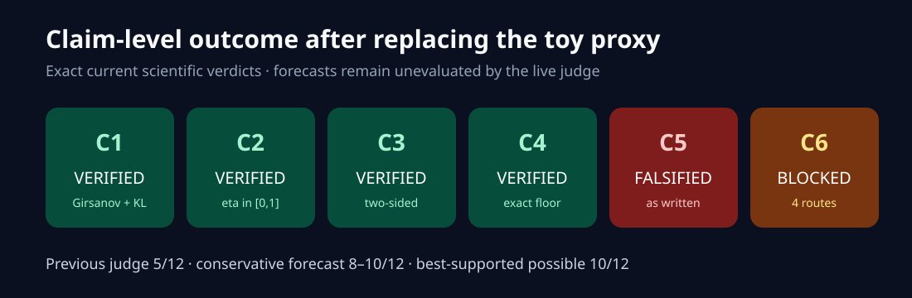
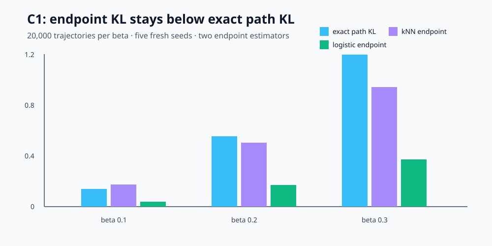
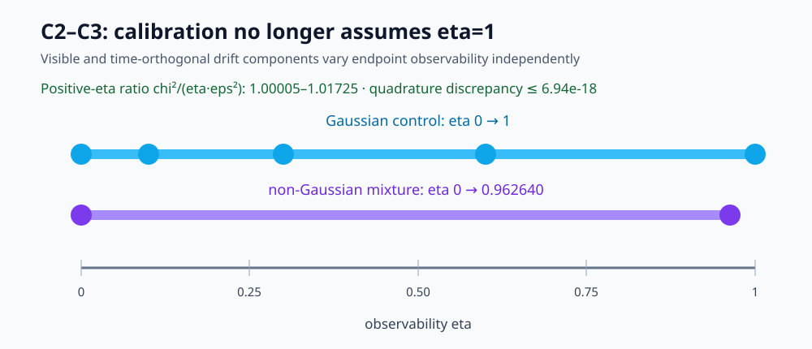
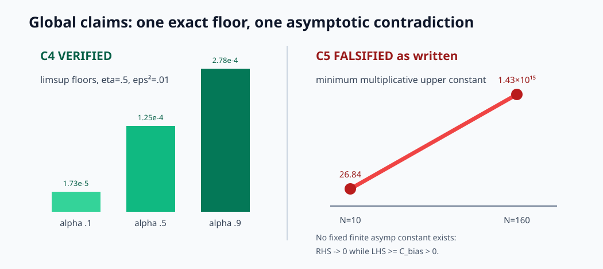
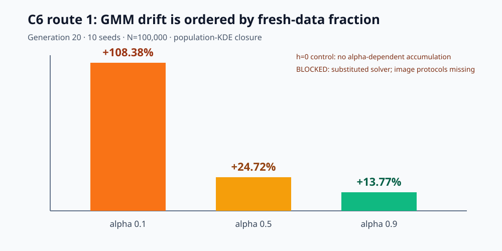

# From Toy Checks to Claim-Level Evidence

The paper asks how score-estimation error survives a diffusion path and accumulates
when each new training generation mixes fresh and synthetic data. The previous
reproduction earned 5/12 because it reduced five theoretical statements to a
one-dimensional Gaussian mean shift and skipped the empirical claim. This campaign
replaced those proxies with checked derivations, non-Gaussian and arbitrary-
observability calibrations, exact long-horizon logic, and a paper-scale GMM route.

The result is deliberately not 12/12: C1–C4 are VERIFIED, C5 is FALSIFIED as
written, and C6 remains BLOCKED. The live judge has not evaluated this revision;
8–10/12 is the conservative forecast and 10/12 the best-supported possibility.

## What was implemented

One fixed entrypoint, `uv run --frozen python -m repro_campaign.run`, imports each
accepted claim module from a committed config. Each module returns structured
evidence and raises on a failed proof rule, assumption audit, calibration gate, or
negative control. A separate checker handles each proof certificate. The locked
Python 3.12 environment is identical across the experiment tree.

The key design decision was to separate universal claims from finite calibration.
For C1–C4, a derivation graph carries the source quantifier; stochastic or exact
families test the implementation in regimes that the old eta=1 Gaussian proxy could
not reach. Mutation controls change the actual claimed coefficients, not convenient
surrogate tolerances.

## Path error reaches endpoint divergence

Proposition 3.1 follows from the learned-measure Girsanov path KL and data
processing. The certificate checks the exact `1/2`; a `0.49` mutation is rejected.
The 10D calibration then compares two independent endpoint estimators with the exact
discrete path budget.

Across beta 0.1, 0.2, and 0.3, path KL was 0.1403, 0.5469, and 1.1973. No endpoint
estimate significantly exceeded its corresponding budget, while both estimators
rejected a false 0.1× budget. The finite simulation is corroboration, not the proof.

Proposition 3.3 and Theorem 3.4 required removing the old eta=1 restriction. A
continuous construction splits drift error into endpoint-visible and
time-orthogonal components, spanning eta from zero to one. The same calculation is
repeated for a symmetric non-Gaussian mixture.

All A1–A4 audits passed. For positive eta, `chi²/(eta·eps²)` lay between 1.00005 and
1.01725; independent quadrature disagreed by at most `6.94e-18`. Eta-zero rows are
kept as edge controls and never used to claim two-sided equivalence.

## Long-horizon logic changes the verdict

Proposition 4.1 contains two statements that the earlier reproduction conflated.
A divergent error-energy series forces a divergent sum of divergences. Its explicit
nonzero limsup floor additionally needs an eventual pointwise error floor. The new
certificate reconstructs the exact constant and includes a valid
`eps_i²=1/(i+1)` control where `D_i→0` but both series diverge.

Theorem 4.2 produces a sharper result: its main display is false as written. The
paper defines `asymp` multiplicatively and places a fixed positive `C_bias` only on
the left. Under its summability assumption the right side tends to zero, while the
left remains at least `C_bias`.

At alpha 0.1 the minimum required upper multiplicative constant grows from 26.84 at
N=10 to `1.43e15` at N=160. Setting the bias to zero or putting it on the right
removes the contradiction, and the checker then refuses the falsification. The
appendix's weaker additive bounds are explicitly not challenged.

## The empirical claim: useful evidence, honest block

The GMM route matches the paper's dimension, geometry, N, alpha values, horizon,
and ten-run replication. Its exact population-KDE closure avoids an otherwise
unpublished acceleration for a 100,000-center KDE; that is a material substitution.

The effect is strong and aligned: generation-20 total-second-moment drift is
+108.38%, +24.72%, and +13.77% as alpha rises. A bandwidth-zero control removes the
effect. But aligned GMM evidence cannot stand in for the literal finite-KDE solver
or the Fashion-MNIST and CIFAR-10 campaigns.

Three additional routes prevent a vague “inconclusive” label. The Fashion source
omits eleven material fields; even a 737-parameter optimistic benchmark projects
6.59 CPU-hours for the stated workload. The CIFAR source omits twenty
CIFAR-specific fields and publishes observability rather than a direct drift curve.
A mandatory falsification search finds no assumption-satisfying contradiction; its
explicit-threshold control proves the checker is capable of accepting one.

## Compute and reproducibility

All scientific runs used Hugging Face `cpu-upgrade`, never a GPU. The flavor
advertised 8 vCPU; the container exposed 64 logical/affinity CPUs, so active work was
explicitly bounded to eight. Successful job durations were 26–69 seconds for the
cumulative verifier; the Fashion 6.59-hour value is a projected lower bound for the
unrun image workload, not billed compute.

| Claim line | Scientific commit | Assessment |
| --- | --- | --- |
| C1 | `20bf5fe` | VERIFIED |
| C2–C3 | `82ebd6a` | VERIFIED / VERIFIED |
| C4–C5 | `a6ace14` | VERIFIED / FALSIFIED |
| C6 GMM | `6bdd221` | aligned partial evidence |
| C6 final audit | `19aa525` | BLOCKED after four routes |

## Assessment

The campaign supplies direct, reproducible claim contracts for all six claims.
C1–C4 now have proof-level evidence calibrated outside the old toy family. C5 earns
a full-credit-style FALSIFIED verdict only for the exact theorem display. C6 does
not earn credit: its strongest evidence is aligned but substituted, and the image
protocol cannot be uniquely reconstructed. The exact missing capability is now
visible rather than deferred. The exact orchestration and release commands are
listed in the [campaign command ledger](command_ledger.md).
